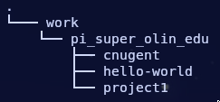

# 1. Linux Worksheet
suggested reading: https://labex.io/linuxjourney/courses/command-line

Please download this file and fill it out before your training. For all questions please answer with a full command, including arguments.

1. How can you find the absolute path of the directory you are currently in?
2. How can you list the current directory's contents?
3. How can you navigate into a directory named `hello-world` that is in `/work/pi_super_olin_edu`? (directory tree provided below)

4. How can you make a new directory in the current directory?
5. How can you remove a directory named `foo` in the current directory?
6. How can you move a file named `log1.log` into a directory at `/home/user`?

Learning how to search the web for commands is an important skill when working with the command line. An answer to this question is not included in the reading.
- How can i find the string `66360bccb` in any file in the current directory, including subdirectories?
